# COMPUTER-NETWORKS-AND-OPERATING-SYSTEMS-LAB
LAB PROGRAMS

# FCFS progran status
##program files of FCFS

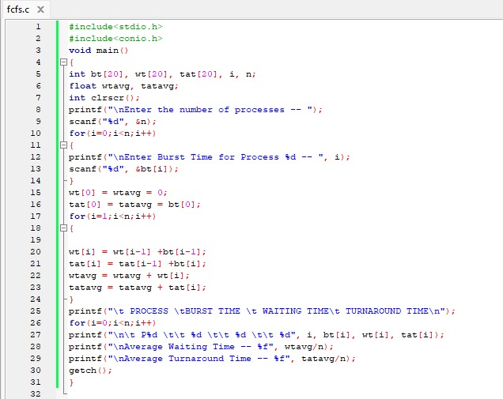

##sample input and output of FCFS

##tested input and output of FCFS

# SJF progran status
##program files of SJF

##sample input and output of SJF
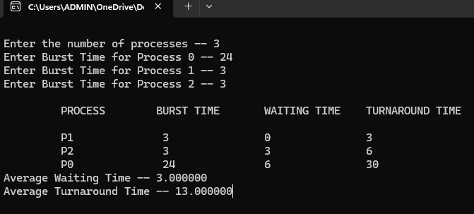

##tested input and output of SJF

# RoundRobin program status

##program files ofRoundRobin

##sample input and output of RoundRobin

##tested input and output of RoundRobin

# Priority program status

##program files of Priority

##sample input and output of Priority

##tested input and output of Priority

# Producer&Consumer program status

##program files of Producer&Consumer

##sample input and output of Producer&Consumer

##tested input and output of Producer&Consumer

# Dining Philosopher program status

##program files of Dining Philosopher

##sample input and output of Dining Philosopher

##tested input and output of Dining Philosopher

# MVT program status

##program files of MVT

##sample input and output of MVT
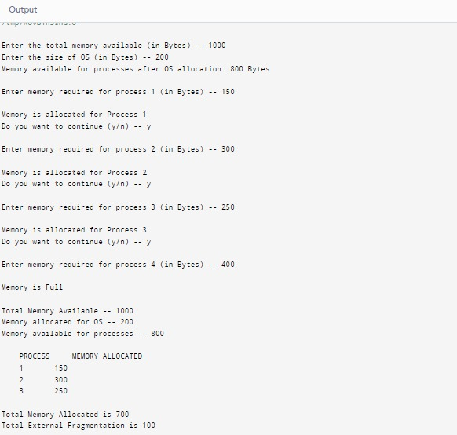

##tested input and output of MVT

# MFT program status

##program files of MFT

##sample input and output of MFT

##tested input and output of MFT

# Worst Fit program status

##program files of WorstFit

##sample input and output of WorstFit

##tested input and output of WorstFit

# Best Fit program status

##program files of BestFit

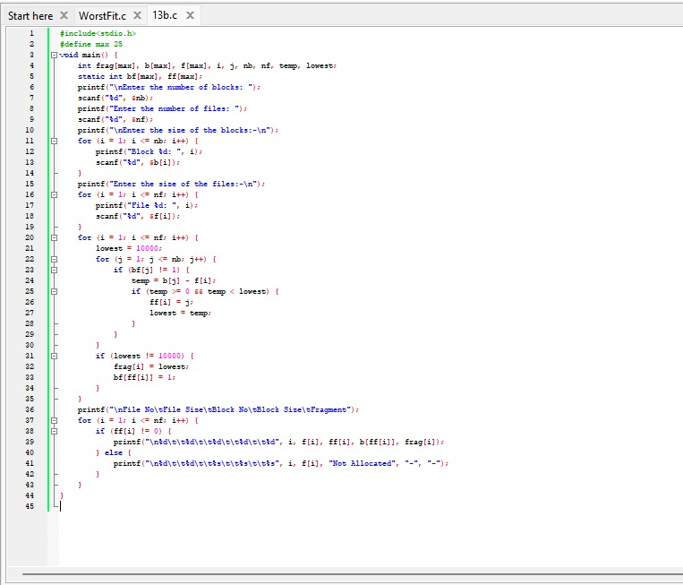

##sample input and output of BestFit

##tested input and output of WorstFit

# First Fit program status

##program files of FirstFit

##sample input and output of FirstFit

##tested input and output of FirstFit

# FIFO Page Replacement Algorithm program status

##program files of FIFO Page Replacement Algorithm

##sample input and output of FIFO Page Replacement Algorithm
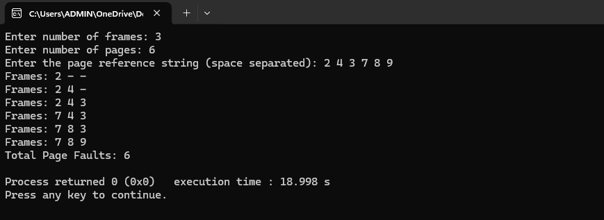

##tested input and output of FIFO Page Replacement Algorithm

# LRU Page Replacement Algorithm program status

##program files of LRU Replacement Algorithm

##sample input and output of LRU Page Replacement Algorithm

##tested input and output of LRU Page Replacement Algorithm

# Optimal Page Replacement Algorithm program status

##program files of  Optimal Replacement Algorithm

##sample input and output of Optimal Page Replacement Algorithm
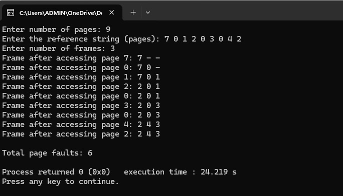

##tested input and output of Optimal Page Replacement Algorithm

# SingleLevelDirectory program status

##program files of SingleLevelDirectory

##sample input and output of SingleLevelDirectory

##tested input and output of SingleLevelDirectory
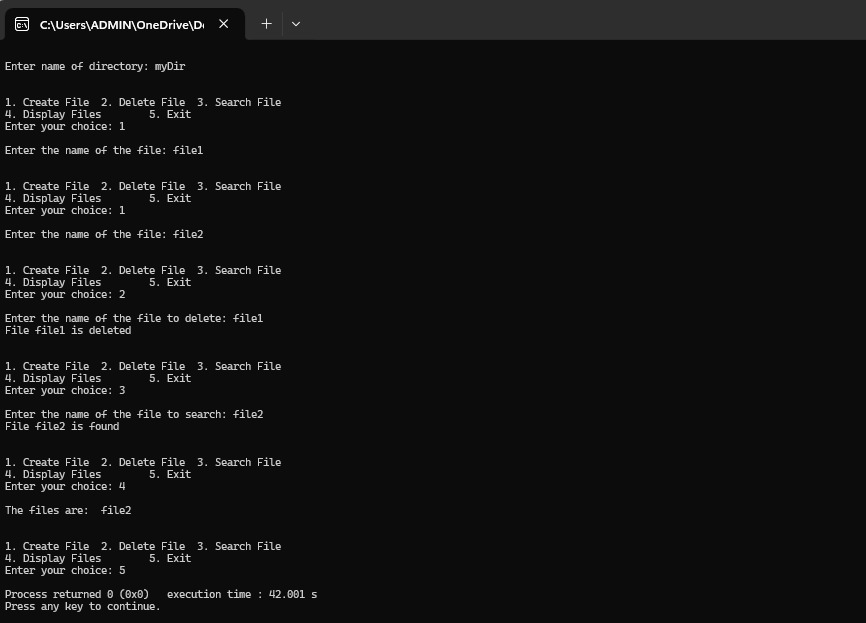

# SecondLevelDirectory program status

##program files of SecondLevelDirectory

##sample input and output of SingleLevelDirectory

##tested input and output of SingleLevelDirectory

# Sequential File Allocation program status

##program files of Sequential File Allocation

##sample input and output of Sequential File Allocation
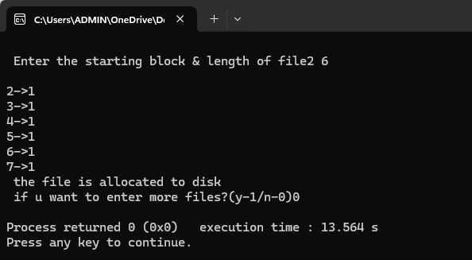

##tested input and output of Sequential File Allocation

# Indexed File Allocation program status

##program files of Indexed File Allocation

##sample input and output of Indexed File Allocation

##tested input and output of Indexed File Allocation

# Linked File Allocation program status

##program files of Indexed File Allocation

##sample input and output of Indexed File Allocation

##tested input and output of Indexed File Allocation

# Dead Lock Avoidance program status

##program files of Dead Lock Avoidance

##sample input and output of Dead Lock Avoidance

##tested input and output of Dead Lock Avoidance

# Dead Lock Prevention program status

##program files of Dead Lock Prevention

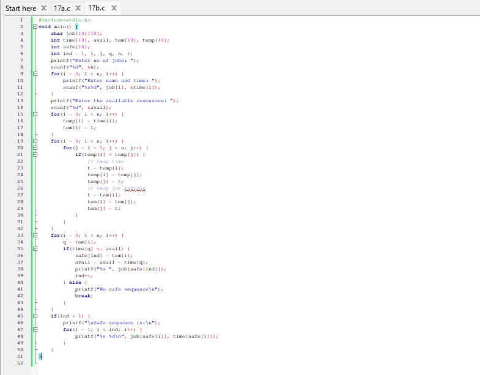

##sample input and output of Dead Lock Prevention
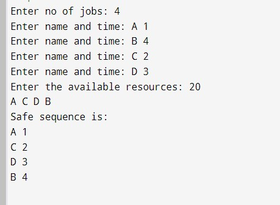

##tested input and output of Dead Lock Prevention
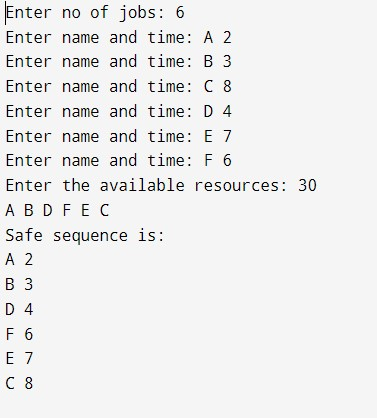

# FCFS Disk Scheduling program status

##program files of FCFS Disk Scheduling

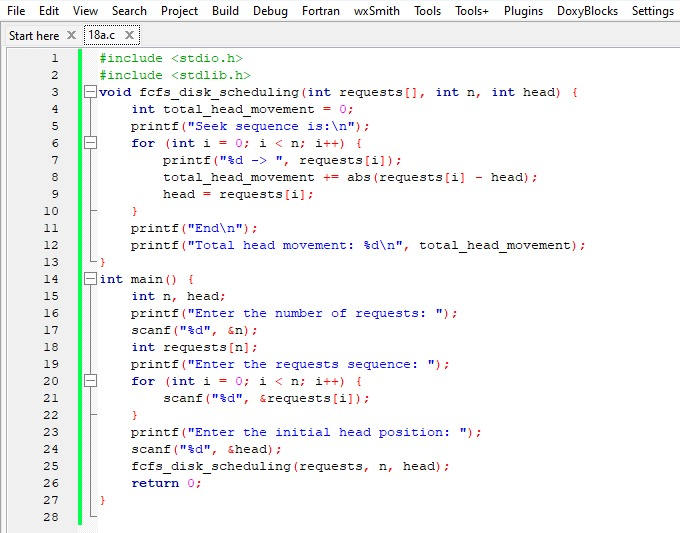

##sample input and output of FCFS Disk Scheduling
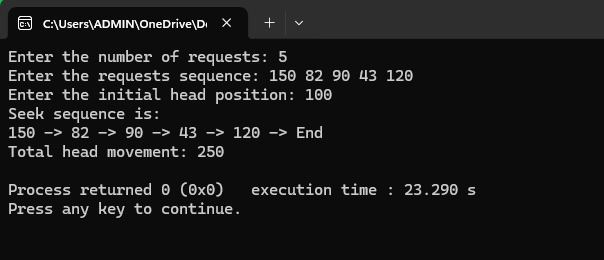

##tested input and output of FCFS Disk Scheduling

# SCAN Disk Scheduling program status

##program files of Scan Disk Scheduling

##sample input and output of Scan Disk Scheduling

##tested input and output of Scan Disk Scheduling

# C SCAN Disk Scheduling program status

##program files of C Scan Disk Scheduling

##sample input and output of C Scan Disk Scheduling

##tested input and output of C Scan Disk Scheduling

